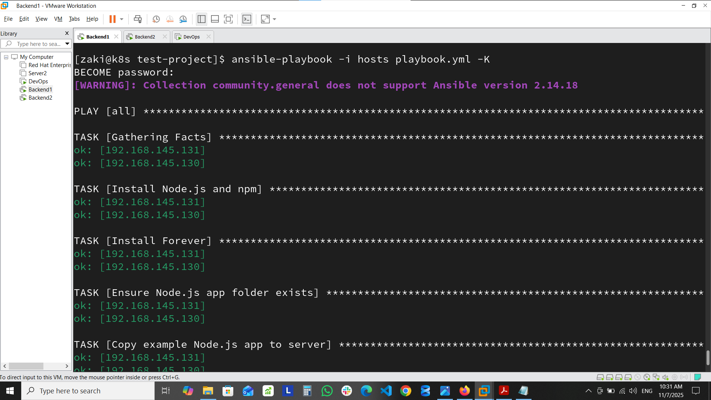
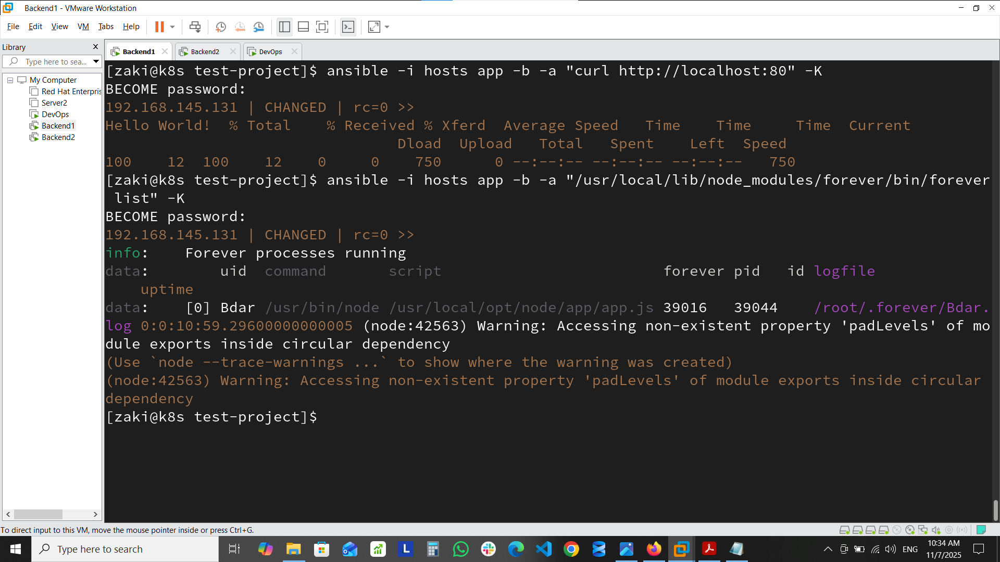
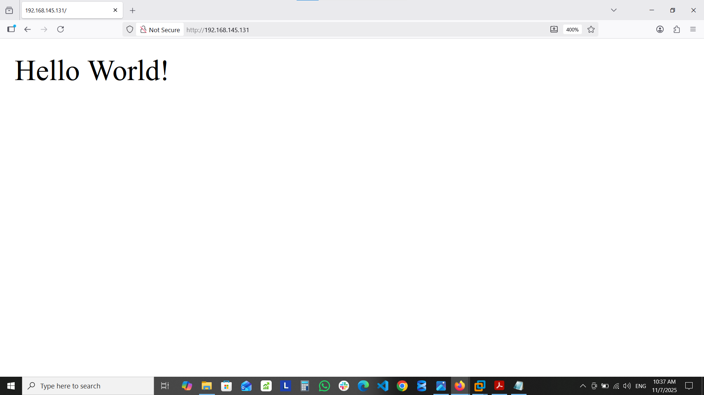

# Node.js Automated Deployment with Ansible


## 🚀 Overview
Automated deployment of Node.js application using Ansible.

## 📋 Features
- **Infrastructure as Code**: Complete environment provisioning
- **Process Management**: Forever for application lifecycle
- **Idempotent**: Safe to run multiple times

## 🛠️ Technologies
- **Ansible**: Configuration management
- **Node.js**: Application runtime
- **Express**: Web framework
- **Forever**: Process manager
- **RHEL**: Target environment

## 📁 Project Structure
```text
nodejs-ansible-deployment/
├── playbook.yml 
├── hosts
├── app/ 
│ ├── app.js 
│ └── package.json
├── docs/
│ ├── playbook-success1.png
│ ├── playbook-success2.png
│ ├── verification-commands.png
│ └── browser-output.png
└── README.md
```

## 🚀 Quick Start
```bash
# Clone repository
git clone https://github.com/Mohamedzaakii/nodejs-ansible-deployment.git
cd nodejs-ansible-deployment

# Deploy application
ansible-playbook -i hosts playbook.yml 
```
- #### Playbook-Success
  

## ✅ Verification
```bash
# Check application status
ansible -i hosts app -b -a "forever list"

# Test application
ansible -i hosts app -b -a "curl http://server-ip"
```
- ####  Verification Commands
  

- #### Deployment Results
  

## 🔧 Configuration
Edit hosts file to match your server IPs:
```bash
[app]
192.168.145.131

[db] 
192.168.145.130
```

    


